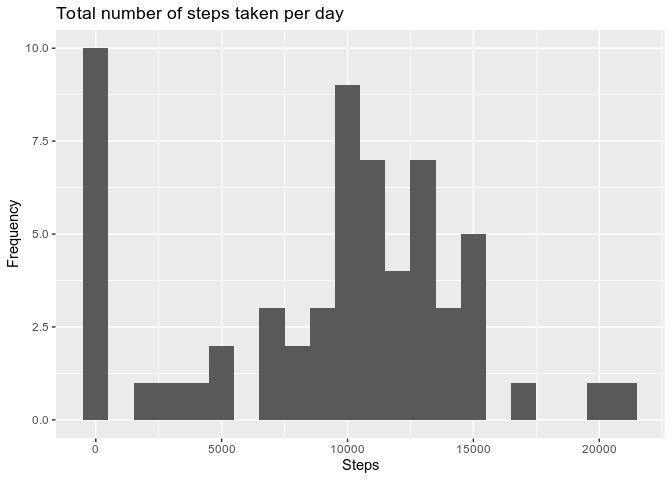
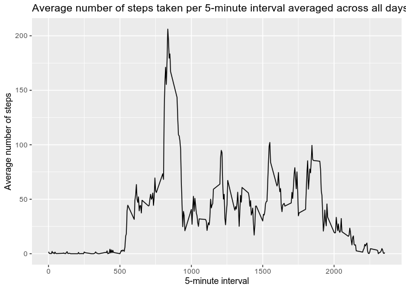
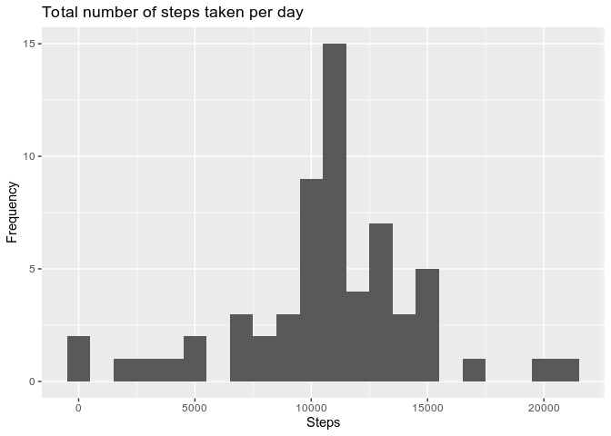
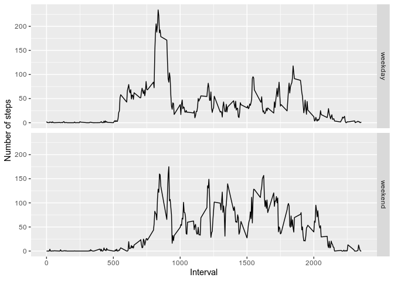

## Set global options: 


```r
knitr::opts_chunk$set(echo = TRUE)
```

## Load the libraries.

```r
library(dplyr)
```

```
## 
## Attaching package: 'dplyr'
```

```
## The following objects are masked from 'package:stats':
## 
##     filter, lag
```

```
## The following objects are masked from 'package:base':
## 
##     intersect, setdiff, setequal, union
```

```r
library(ggplot2)
```


## Loading and preprocessing the data

Load the data.


```r
activityDF <- read.csv(unz("activity.zip", "activity.csv"), na.strings = "NA")
```

Process the data.


```r
activityDF$date <- as.Date(activityDF$date, format = "%Y-%m-%d")
```

## What is mean total number of steps taken per day?

Calculate the total number of steps taken per day.


```r
totalStepsPerDay <- activityDF %>% group_by(date) %>% 
    summarise(steps = sum(steps, na.rm = TRUE))
head(totalStepsPerDay)
```

```
## # A tibble: 6 x 2
##   date       steps
##   <date>     <int>
## 1 2012-10-01     0
## 2 2012-10-02   126
## 3 2012-10-03 11352
## 4 2012-10-04 12116
## 5 2012-10-05 13294
## 6 2012-10-06 15420
```

Histogram of total number of steps per day.


```r
with(totalStepsPerDay, qplot(steps, geom = "histogram",
                             binwidth = 1000,
                             xlab = "Steps",
                             ylab = "Frequency", 
                             main = "Total number of steps taken per day"))
```

<!-- -->

Calculate the mean and median of the total number of steps taken per day.


```r
summaryStepsPerDay <- summary(totalStepsPerDay$steps)
```

The mean of the total number of steps taken per day is: 
9354.23 and the median is:
10395

## What is the average daily activity pattern?

Calculate the number of steps taken averaged across all days per 5-minute 
intervals.


```r
averageStepsPerInterval <- activityDF %>% group_by(interval) %>% 
    summarise(steps = mean(steps, na.rm = TRUE))
head(averageStepsPerInterval)
```

```
## # A tibble: 6 x 2
##   interval  steps
##      <int>  <dbl>
## 1        0 1.72  
## 2        5 0.340 
## 3       10 0.132 
## 4       15 0.151 
## 5       20 0.0755
## 6       25 2.09
```

Time series plot of the 5-minute interval and the average number of steps taken, 
averaged across all days


```r
with(averageStepsPerInterval, qplot(x = interval, y = steps, geom = "line",
                                    xlab = "5-minute interval",
                                    ylab = "Average number of steps",
                                    main = "Average number of steps taken per 5-minute interval averaged across all days"))
```

<!-- -->

Which 5-minute interval, on average across all the days in the dataset, contains 
the maximum number of steps?


```r
maxInterval <- averageStepsPerInterval$interval[which.max(averageStepsPerInterval$steps)]
```

The 5-minute interval, on average across all the days that contains the maximum 
maximum number of steps is: 835.

## Imputing missing values

Calculate and report the total number of missing values in the dataset.


```r
numberOfMissingValues <- sum(is.na(activityDF$steps))
```
The number of missing values in the data set is 2304.  

I will fill the missing values with the value of the mean of the 5-minute
interval across all days.

Create a new dataset that is equal to the original dataset but with the missing 
data filled in.


```r
newActivityDF <- activityDF
for(i in averageStepsPerInterval$interval){
    newActivityDF[activityDF$interval == i & is.na(activityDF$steps), ]$steps <-
        averageStepsPerInterval[averageStepsPerInterval$interval == i, ]$steps
}
```

Calculate the total number of steps taken per day in the new data set.


```r
newTotalStepsPerDay <- newActivityDF %>% group_by(date) %>% 
    summarise(steps = sum(steps, na.rm = TRUE))
head(newTotalStepsPerDay)
```

```
## # A tibble: 6 x 2
##   date        steps
##   <date>      <dbl>
## 1 2012-10-01 10766.
## 2 2012-10-02   126 
## 3 2012-10-03 11352 
## 4 2012-10-04 12116 
## 5 2012-10-05 13294 
## 6 2012-10-06 15420
```

Histogram of total number of steps per day in the new data set.


```r
with(newTotalStepsPerDay, qplot(steps, geom = "histogram",
                             binwidth = 1000,
                             xlab = "Steps",
                             ylab = "Frequency", 
                             main = "Total number of steps taken per day"))
```

<!-- -->

Calculate the mean and median of the total number of steps taken per day in the
new data set.


```r
newSummaryStepsPerDay <- summary(newTotalStepsPerDay$steps)
```

The mean of the total number of steps taken per day is: 
10766.19 and the median is:
10766  

**Do these values differ from the estimates from the first part of the 
assignment? What is the impact of imputing missing data on the estimates of the 
total daily number of steps?**  
Yes, there is a difference in the mean of 1411.96
steps and a difference in the median of 371 
steps.  Inputing missing data, using the strategy I chose, makes the mean and 
the median higher.

## Are there differences in activity patterns between weekdays and weekends?

```r
activityDF <- activityDF %>% 
  mutate(weekTime = factor(if_else(weekdays(date) %in% c("Saturday", "Sunday") |
                                     weekdays(date) %in% c("Sonntag", "Samstag"), # My locale is in german.
                                   "weekend", "weekday")))
```

Panel plot containing a time series plot of the 5-minute interval and the 
average number of steps taken, averaged across all weekday days or weekend days.


```r
averageStepsIntervalWeek <- activityDF %>% group_by(weekTime, interval) %>% 
    summarise(steps = mean(steps, na.rm = TRUE))

with(averageStepsIntervalWeek, qplot(x = interval, y = steps, geom = "line", 
                                     xlab = "Interval", 
                                     ylab = "Number of steps", 
                                     facets = weekTime ~ .))
```

<!-- -->

